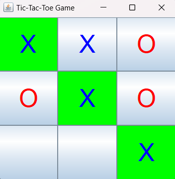

# Tic-Tac-Toe Game

The Tic-Tac-Toe game application is a simple project developed using GUI (Graphical User Interface) in Java. It provides a quick and easy way to play the classic Tic-Tac-Toe game with two players on a 3x3 grid.

## How to Play

1. Clone or download the repository to your local machine.

2. Make sure you have Java installed on your system.

3. Open a terminal or command prompt and navigate to the project directory.

4. Compile the Java file:
```
javac TicTacToeGame.java
```

5. Run the game:
```
java TicTacToeGame
```

6. The game window will appear, showing a 3x3 grid with empty cells.

7. The first player is 'X', and the second player is 'O'.

8. Click on an empty cell to place your symbol ('X' or 'O').

9. Players take turns alternately.

10. The game will automatically check for a win after each move. If a player forms a line (either horizontally, vertically, or diagonally) with their symbol, that player wins the game.

11. If all the cells are filled, and no player has formed a line, the game is declared a draw.

12. After the game ends, you can start a new game by running the application again.

## Screenshot



## License

This project is licensed under the [MIT License](LICENSE).

Feel free to use, modify, and distribute the code as per the terms of the MIT License.


Enjoy the game!
